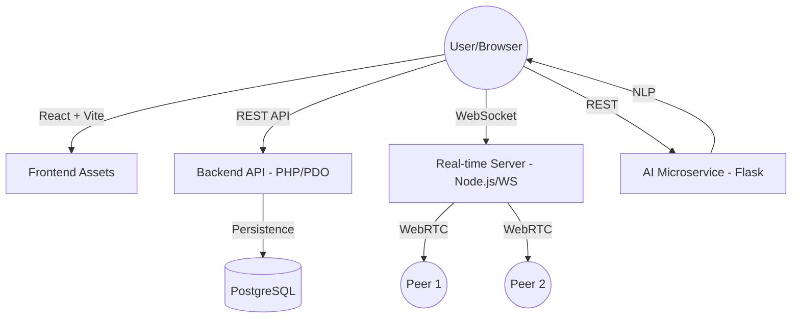

# StudyNest - Professional Student Collaborative Ecosystem

StudyNest is a unified platform designed for university students to collaborate, share resources, and study in real-time. It features a modern, premium UI/UX and a robust multi-service architecture.

## 🏗️ System Architecture



## 🚀 Components & Setup

The project consists of four primary services:

### 1. Frontend (React + Vite)
- **Tech Stack**: React 19, Tailwind CSS 4, Framer Motion, Three.js, Lucide Icons.
- **Setup**:
  ```bash
  npm install
  npm run dev
  ```
- **Build for Production**:
  ```bash
  npm run build
  ```

### 2. Backend API (PHP)
- **Tech Stack**: PHP 8+, PDO (PostgreSQL), JWT Authentication.
- **Path**: `src/api/`
- **Setup**:
  - Configure `src/api/.env` with your database credentials.
  - Run with a local PHP server for development: `php -S localhost:8000 -t .`
- **Configuration**: CORS and session security are centrally managed in `src/api/db.php`.

### 3. Real-time Signaling (Node.js)
- **Tech Stack**: Node.js, `ws` (WebSockets).
- **Path**: `src/realtime/`
- **Setup**:
  ```bash
  cd src/realtime
  npm install
  npm start
  ```
- **Port**: Default is `5173` (ensure this doesn't conflict with your dev server port in specific hosting environments).

### 4. AI Microservice (Python)
- **Tech Stack**: Flask, NLTK (WordNet).
- **Path**: `src/Python/`
- **Setup**:
  ```bash
  cd src/Python
  python -m venv .venv
  source .venv/bin/activate # or .venv\Scripts\activate on Windows
  pip install -r requirements.txt
  python sampar.py
  ```
- **Features**: Automatic summarization and paraphrasing of study notes.

## 🛠️ Deployment Tips

1.  **Environment Variables**: Ensure all `.env` files (API, DB) are correctly configured for your production host.
2.  **HTTPS**: The application is configured to automatically enable `secure` session cookies when HTTPS is detected. Always deploy with SSL.
3.  **Database**: Use the authoritative schema in `database/schema_pg.sql` for PostgreSQL instances.
4.  **Static Assets**: For the React build, ensure your web server (Nginx/Apache) is configured to handle SPA routing by redirecting all requests to `index.html`.

## 🛡️ Security & Audits
- Centralized JWT verification is handled in `src/api/auth.php`.
- Database connections use PDO prepared statements to prevent SQL injection.
- Production-ready CORS headers are implemented to restrict unauthorized origins.

---
*Created by Antigravity for StudyNest.*
